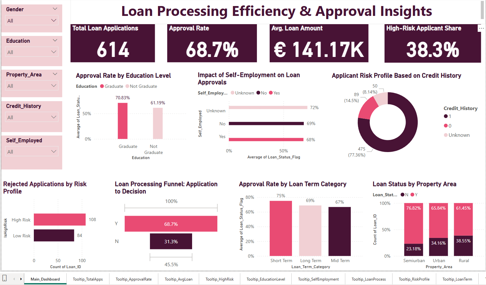

# Loan Processing Efficiency & Approval Insights

This project analyzes loan application data to uncover inefficiencies in the loan approval process and provides data-driven recommendations using Power BI.

---

## 📊 Project Overview

**Objective**  
To identify improvement areas in the loan approval pipeline and understand which factors influence approval rates.

**Tools Used**
- Power BI
- Power Query (data cleaning)
- Word (report documentation)

---

## 🔍 Key Insights

- **Approval Rate:** 68.7% of applicants were approved.
- **High-Risk Applicants:** 38.3% had one or more risk indicators (no credit history, low income, or self-employed).
- **Rejection Reasons:** Poor eligibility filters, missing credit data, and biases in scoring models.

---

## 📁 Files in this Repository

| File Name                                  | Description                              |
|-------------------------------------------|------------------------------------------|
| `Loan_Approval_Insights_Dashboard.pbix`   | Interactive Power BI dashboard           |
| `Loan_Processing_Efficiency_Report.docx`  | Full written analysis and recommendations |
| `Loan_Dashboard_Overview.png`             | Screenshot preview of the dashboard      |

---

## ✅ Suggested Improvements

- Strengthen pre-screening and data validation logic.
- Address bias against self-employed and low-income applicants.
- Enhance the scoring model to include alternate creditworthiness indicators.

---

## 📬 Contact

Created by [Savitha Kandugula](https://www.linkedin.com/in/savithakandugula)  
Feel free to connect or reach out for collaboration or feedback!

